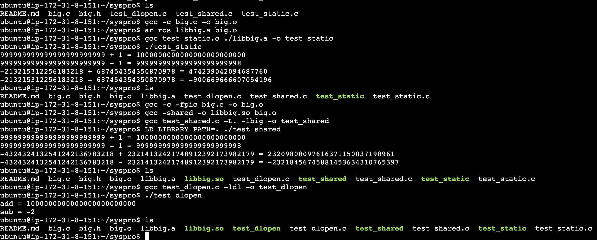

# CSE3209 시스템 프로그래밍 라이브러리 과제

컴퓨터공학과 12223759 오유찬

## 1. 라이브러리 기능
이 프로젝트 라이브러리는 아래 함수 1개를 제공합니다.

- `int add(int a, int b);`

---

## 2. 파일 구성

### 라이브러리 파일
- `add.c`
- `add.h`

### 테스트 소스 코드(최소 2개 이상)
- `test_static.c`  : 정적 라이브러리(.a) 링크 테스트
- `test_shared.c`  : 공유 라이브러리(.so) 링크 테스트
- `test_dlopen.c`  : run-time linking 테스트 (`dlopen/dlsym` 사용)

### 빌드 산출물
- `libadd.a` (static library)
- `libadd.so` (shared library)
---

## 3. 빌드/실행 방법 (Makefile 없이 gcc 명령어만 사용)

### 3.1 정적 라이브러리(.a) 만들기 + 테스트

#### (1) 오브젝트 파일 생성
```bash
gcc -c add.c
````

#### (2) 아카이브(.a) 생성

```bash
ar rcs libadd.a add.o
```

#### (3) 정적 링크 후 실행

```bash
gcc test_static.c ./libadd.a -o test_static
./test_static
```

---

### 3.2 공유 라이브러리(.so) 만들기 + 테스트

#### (1) PIC 오브젝트 파일 생성 (-fpic)

```bash
gcc -c -fpic add.c
```

#### (2) 공유 라이브러리(.so) 생성 (-shared)

```bash
gcc -shared -o libadd.so add.o
```

#### (3) 공유 라이브러리 링크 후 실행

```bash
gcc test_shared.c -L. -ladd -o test_shared
LD_LIBRARY_PATH=. ./test_shared
```

---

### 3.3 Run-time linking (dlopen/dlsym) 테스트

#### (1) 빌드 (-ldl 필요)

```bash
gcc test_dlopen.c -ldl -o test_dlopen
```

#### (2) 실행

```bash
./test_dlopen
```

---

## 4. 실행 결과 예시

```
add(2, 3) = 5
add(10, 20) = 30
add(7, 8) = 15
```

---

## 5. 스크린샷

---

